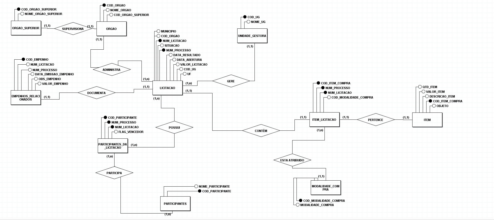
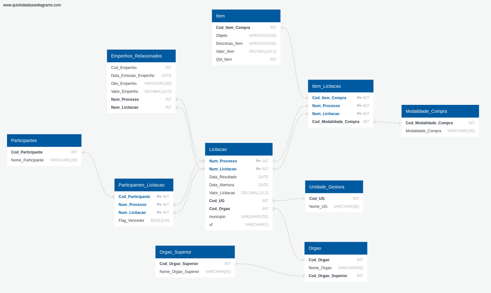

# Normalização de Banco de Dados e e inserção no PostgreSQL
## Visão Geral
Este repositório documenta um trabalho da faculdade focado na seleção de um banco de dados público disponível em formato de planilha, normalizando os dados e importando-os para um banco de dados PostgreSQL. O principal objetivo deste projeto é demonstrar o processo de transformação de dados brutos em um banco de dados estruturado e normalizado, possibilitando consultas e análises eficientes.

## Base de Dados Escolhida
Escolhemos uma base de dados pública do governo para fazer esse processo de normalização  
[Clique aqui para ver a base de dados](https://portaldatransparencia.gov.br/pagina-interna/603389-dicionario-de-dados-licitacoes)

## Modelo Entidade Relacionamento

 

## Modelo Lógico

[Relatório final](relatorio.pdf)
[Apresentação de slides](slides.pdf)

